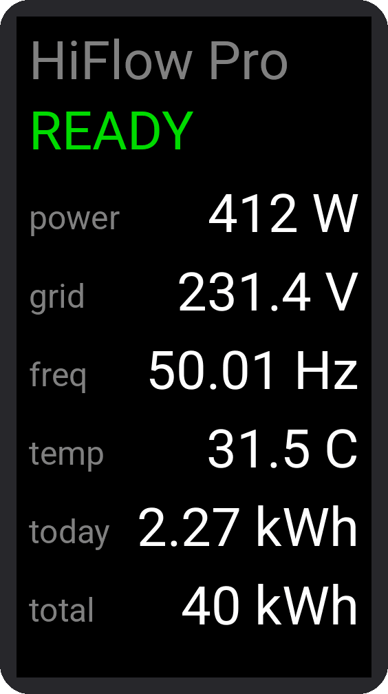

# HiFlow Pro to Zigbee bridge (ESP32-C6)

An ESPHome firmware that reads a **Hoymiles HiFlow Pro** inverter locally over **Bluetooth LE**
and reports its measurements as a **Zigbee end device** to Home Assistant (ZHA). No WiFi, no
cloud: only BLE (to the inverter) and 802.15.4 (to your Zigbee coordinator).

```
inverter ──BLE──> ESP32-C6 ──Zigbee──> coordinator ──ZHA──> Home Assistant
```

It keeps one **persistent** BLE session (log in once, poll every 30 s over the same link) and
exposes 31 values: AC power/voltage/current/frequency, reactive power, power factor,
temperature, energy total/today, the inverter's daily warning count, power/voltage/current and
energy total/today for each of the four PV ports, plus the session status. A value is reported
when it changes noticeably or after a few minutes at the latest, not on every 30 s poll.

The protocol implementation is a C port of [TheTiEr/hiflow-ble](https://github.com/TheTiEr/hiflow-ble),
the library behind the [ha-hiflow-ble](https://github.com/TheTiEr/ha-hiflow-ble) integration. It
is checked against reference vectors generated with that library.

## Status

Tested on one **HMS-2000-4WB** with a Seeed **XIAO ESP32-C6** and ZHA. Other HiFlow Pro / HMS-WB
models that work with ha-hiflow-ble should work too. Zigbee2MQTT is untested. Reports are welcome.

## What you need



- A **Seeed Studio XIAO ESP32-C6** ([Amazon.de](https://www.amazon.de/dp/B0D2NKVB34)) or a
  **Waveshare ESP32-C6-LCD-1.47** ([Amazon.de](https://www.amazon.de/dp/B0DHTMYTCY)). The board
  is picked with the `board` setting in `hiflow_secrets.yaml` (see *Boards* in
  `docs/development.md`): the XIAO variant drives its RF switch and can use an external U.FL
  antenna, the Waveshare variant shows the values on its on-board 172x320 display (rendering on
  the right, example values).
- A Zigbee coordinator in Home Assistant (ZHA), on current firmware. Tested with a ConBee III
  ([Amazon.de](https://www.amazon.de/dp/B0C8HV79N7)) on deCONZ firmware **0x26550900**.
- ESPHome with native Zigbee on the ESP32-C6 (tested with **2026.8.2**), plus Python 3 for the
  helper scripts.
- The inverter within BLE range of the board. An external U.FL antenna is optional.
- **Nothing else connected to the inverter over BLE.** It serves exactly one BLE central. Close
  the S-Miles app, and disable the ha-hiflow-ble integration and any BLE proxy that talks to it.

## Quick start

1. **Credentials.** Copy `hiflow_secrets.example.yaml` to `hiflow_secrets.yaml` and fill it in.
   The comments in the file say where each value comes from:
   - set `board` to `xiao_esp32c6` or `waveshare_c6_lcd147`;
   - the serial tail comes from the inverter's BLE name `RMI-XXXXXXXXXXXX`, the MAC address from
     a BLE scanner app or Home Assistant's Bluetooth panel (the two differ);
   - get a `ble_id` from `python3 tools/gen_ble_id.py`, or reuse the one from ha-hiflow-ble;
   - the PIN is the Bluetooth PIN from the S-Miles app;
   - set whether the external antenna is used.

   The build stops with an error while the MAC, the serial or the `ble_id` still hold the
   example values: a bridge built with them would never find the inverter.
2. **Time zone.** Check `offset` and `eu_dst` under `hiflow_ble:` in `esp32c6.yaml` (default:
   CET with European summer time). The inverter's own clock is set from them, and that clock
   drives its daily energy reset.
3. **Build first:**
   ```bash
   esphome compile esp32c6.yaml
   ```
   The first build compiles ESP-IDF and takes several minutes, longer than ZHA's pairing window.
4. **Open pairing, then flash** over USB. In Home Assistant, open ZHA, click *Add device* and leave
   it open, then run:
   ```bash
   DEV=/dev/ttyACM0 tools/flash_config.sh esp32c6.yaml
   ```
   `DEV` is the board's port (`ls /dev/serial/by-id/`, it shows up as *Espressif USB JTAG*); with
   a Zigbee stick on the same computer, make sure it is not the stick. The board looks for a
   network only during its first seconds after a boot, then only every 10 minutes.

   The script erases the whole flash first if the board ran any other firmware before: a BLE
   proxy, another ESPHome config, another Zigbee firmware. It compares the partition table on
   the board with the new one. The old firmware's settings would otherwise end up inside the
   bridge's, and neither BLE nor Zigbee comes up. Reflashing the bridge keeps its settings and
   its Zigbee pairing. Flash with `esphome run` only if you erase first
   (`esptool --chip esp32c6 --port /dev/ttyACM0 erase_flash`).

   The board joins as `HMS-2000-4WB Bridge`. If it missed the pairing window, open
   *Add device* again and reset the board (RESET button or re-plug).
5. **Optional: name the entities.** ZHA names analog inputs generically. This command gives
   them the ids `sensor.inverter_zb_*` and English names by endpoint:
   ```bash
   python3 -m venv .venv && .venv/bin/pip install websockets
   HASS_URL=http://homeassistant.local:8123 HASS_TOKEN=<long-lived token> \
     .venv/bin/python tools/ha_fix_bridge_entities.py
   ```
   `--hide-extras` leaves only the AC power visible, `--prefix` changes the ids, and `--dry-run`
   only shows what would happen.
6. **Optional: add it to the energy dashboard.** ZHA analog inputs can only be `measurement`,
   so the energy dashboard needs a template sensor on top. It is in
   `docs/ha-energy-template.yaml`.

Put the board at the inverter and power it from a USB charger. The deployed image logs at
`WARN`, which matters on a charger (see `docs/troubleshooting.md`).

## More documentation

- [`docs/troubleshooting.md`](docs/troubleshooting.md): radio, inverter, Zigbee and USB details
- [`components/hiflow_ble/README.md`](components/hiflow_ble/README.md): the component on its own
  (use it from GitHub in your own ESPHome config), configuration reference, protocol notes
- [`docs/development.md`](docs/development.md): repository layout, host tests, build and flash
  tools, how the session works, and the status codes of `sensor.inverter_zb_status`

## Limitations

- Right after a boot, ZHA shows 0 for the measurements until the first data page arrives (about
  30 s later). The energy total is not affected, so the energy dashboard stays correct.
- Read-only: no power limit. The ESPHome Zigbee component cannot expose `number` entities on the
  ESP32 yet.
- All measurements that ha-hiflow-ble shows are exposed, except the per-port error code (in
  practice the same `0x03000000` on every port while the inverter feeds in). The warning count
  says how many warnings there were, not which ones.

## Credits and license

MIT, see `LICENSE`. The protocol knowledge, the `.proto` files and the Python reference code in
`test/ref/` come from [TheTiEr/hiflow-ble](https://github.com/TheTiEr/hiflow-ble) (MIT).
[nanopb](https://github.com/nanopb/nanopb) is vendored under its zlib license. See
`THIRD_PARTY.md`.