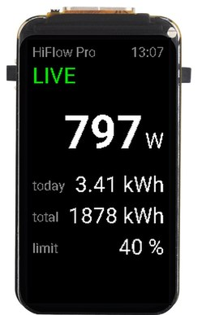
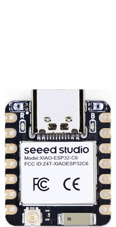
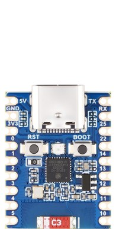
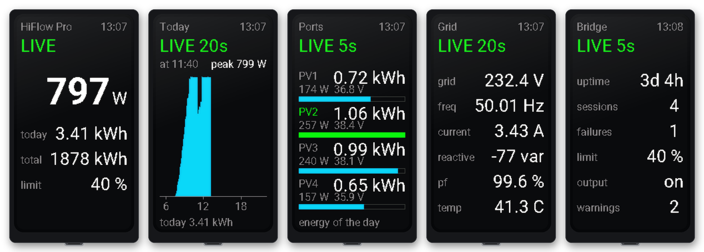

# HiFlow Pro to Zigbee bridge (ESP32-C6 / ESP32-H2)

An ESPHome firmware that reads a **Hoymiles HiFlow Pro** inverter locally over **Bluetooth LE**
and reports its measurements as a **Zigbee end device** to Home Assistant.
No WiFi, no cloud: only BLE (to the inverter) and 802.15.4 (to your Zigbee coordinator).

```
inverter ──BLE──> ESP32-C6/H2 ──Zigbee──> coordinator ──ZHA / Zigbee2MQTT──> Home Assistant
```

It keeps one **persistent** BLE session (log in once, poll every 30 s over the same link) and
exposes 33 values: AC power/voltage/current/frequency, reactive power, power factor,
temperature, energy total/today, the inverter's daily warning count, power/voltage/current and
energy total/today for each of the four PV ports, plus the session status and the board's
uptime and chip temperature. A value is reported when it changes noticeably or after a few minutes at the latest,
not on every 30 s poll.
It also adds a slider for the inverter's power limit and a switch that turns the inverter on
and off.

The protocol is a C port of [TheTiEr/hiflow-ble](https://github.com/TheTiEr/hiflow-ble), the
library behind the [ha-hiflow-ble](https://github.com/TheTiEr/ha-hiflow-ble) integration.

## Status

Tested on one **HMS-2000-4WB** with a Seeed **XIAO ESP32-C6** and a **Waveshare
ESP32-C6-LCD-1.47**. The **Waveshare ESP32-H2-Zero** has run on the bench (with a simulated
inverter, updates over Zigbee included), not yet at an inverter.
Other HiFlow Pro / HMS-WB models that work with ha-hiflow-ble should work too. Reports are
welcome.

## What you need

- One of the boards in the table below.
- A Zigbee coordinator in ZHA or Zigbee2MQTT (2.8.0 or newer).
- ESPHome with native Zigbee on the ESP32-C6 / ESP32-H2 (tested with **2026.9.1**), plus
  Python 3 for the helper scripts.
- The inverter within BLE range of the board.
- **Nothing else connected to the inverter over BLE.** It serves exactly one BLE central, so end
  every other BLE connection to it (e.g. the S-Miles app).

### Boards

| | <br>ESP32-C6-LCD-1.47 | <br>XIAO ESP32-C6 | <br>ESP32-H2-Zero |
|---|:---:|:---:|:---:|
| Price (Amazon) | [~20 €](https://www.amazon.de/dp/B0DHTMYTCY) | [~18 €](https://www.amazon.de/dp/B0D2NKVB34) | [~10 €](https://www.amazon.de/dp/B0FR55G13T) |
| Chip | ESP32-C6, 512 KB RAM | ESP32-C6, 512 KB RAM | ESP32-H2, 320 KB RAM |
| Display | 1.47" 172x320 | none | none |
| Antenna | ceramic | ceramic, or external (U.FL) | ceramic |
| Good | shows the values on the board itself | external antenna when the Zigbee router/coordinator is far away | cheapest |
| Downsides | no external antenna | no display | less RAM, slower full updates, no display, no external antenna |

## Quick start

1. **Credentials.** Copy `hiflow_secrets.example.yaml` to `hiflow_secrets.yaml` and fill it in.
   The comments in the file say where each value comes from:
   - set `board` to `xiao_esp32c6`, `waveshare_c6_lcd147` or `waveshare_h2_zero`;
   - the serial tail comes from the inverter's BLE name `RMI-XXXXXXXXXXXX`, the MAC address from
     a BLE scanner app or Home Assistant's Bluetooth panel (the two differ);
   - get a `ble_id` from `python3 tools/gen_ble_id.py`, or reuse the one from ha-hiflow-ble;
   - the PIN is the Bluetooth PIN from the S-Miles app;
   - set whether an external antenna is used (XIAO only);
   - `sleepy` stays `"true"` for the low-power mode (see *Low power* below).

   The build stops with an error while the MAC, the serial or the `ble_id` still hold the
   example values: a bridge built with them would never find the inverter.
2. **Time zone.** Check `offset` and `eu_dst` under `hiflow_ble:` in `hiflow-zb.yaml` (default:
   CET with European summer time). The inverter's own clock is set from them, and that clock
   drives its daily energy reset.
3. **Build first:**
   ```bash
   esphome compile hiflow-zb.yaml
   ```
   The first build compiles ESP-IDF and takes several minutes, longer than the coordinator's
   pairing window.
4. **Open pairing, then flash** over USB. In ZHA click *Add device*, in Zigbee2MQTT *Permit join*,
   and leave it open, then run:
   ```bash
   DEV=/dev/ttyACM0 tools/flash_config.sh hiflow-zb.yaml
   ```
   `DEV` is the board's port (`ls /dev/serial/by-id/`, it shows up as *Espressif USB JTAG*); with
   a Zigbee stick on the same computer, make sure it is not the stick.

   The script erases the whole flash first if the board ran other firmware before (a BLE proxy,
   another ESPHome config), because that firmware's settings would keep the bridge from coming
   up. Reflashing the bridge keeps its settings and its Zigbee pairing. Flash with `esphome run`
   only after an erase (`esptool --port /dev/ttyACM0 erase_flash`).

   The board joins as `HMS-2000-4WB Bridge`. If it missed the pairing window, open pairing again
   and reset the board (RESET button or re-plug).
5. **Optional, ZHA: name the entities.** ZHA names analog inputs generically. This command gives
   them the ids `sensor.inverter_zb_*` and English names by endpoint:
   ```bash
   python3 -m venv .venv && .venv/bin/pip install websockets
   HASS_URL=http://homeassistant.local:8123 HASS_TOKEN=<long-lived token> \
     .venv/bin/python tools/ha_fix_bridge_entities.py
   ```
   `--hide-extras` leaves only the AC power visible, `--prefix` changes the ids, and `--dry-run`
   only shows what would happen.
6. **Optional: add it to the energy dashboard.** ZHA analog inputs can only be `measurement`,
   so the energy dashboard needs a template sensor on top. It is in
   `docs/ha-energy-template.yaml`.

Put the board at the inverter and power it from a USB charger. The deployed image logs at
`WARN`, which matters on a charger (see `docs/troubleshooting.md`).

## Controls

Next to the measurements, the bridge adds two controls.

- **Power limit** (endpoint 32): a slider in percent of the rated power, in 10 % steps. The
  inverter keeps the limit in its own flash. It is meant for a limit you set now and then, not
  for zero-export regulation. 0 % switches the output off.
- **On/off** (endpoint 34): a switch for the inverter's output. The inverter does not report
  whether it is on, so the switch shows what the bridge last switched it to. A change made in
  the S-Miles app does not show.

A change that cannot reach the inverter within two minutes (at night, for example) is dropped
and the control goes back. The details are in the configuration reference in
[`components/hiflow_ble/README.md`](components/hiflow_ble/README.md).

In ZHA the slider falls back to 0-1023 after every re-interview (an update over Zigbee,
*Reconfigure*, a re-join), because ZHA only keeps its range in a cache. The quirk
[`docs/zha_quirk_hiflow_bridge.py`](docs/zha_quirk_hiflow_bridge.py) keeps it at 0-100 %: copy it
into the folder that `zha: custom_quirks_path:` points to and restart Home Assistant.

## Network time

The bridge asks the Zigbee coordinator for the time, through a Time client cluster on endpoint 35:
once after joining, then twice a day. The bridge sets the inverter's clock at every login, and
that clock drives the inverter's daily energy reset, so the time stays right even after a power
cut at night.

## Low power

By default the bridge is a sleepy Zigbee end device: its receiver is off between polls, and the
chip light-sleeps in between (the C6-LCD by day too, its backlight keeps running). It runs much
cooler, and it is a first step towards running the bridge on a battery. A command such as the
power limit still reaches it within a few seconds. With `sleepy: "false"` in
`hiflow_secrets.yaml` the receiver stays on all the time.

Switching it either way makes the bridge leave the network and join again, also when an update
brings the new setting to a bridge that ran the other one: open pairing (ZHA: *Add device*)
before you flash or install it. ZHA keeps the device and its entities. The details are in
[`components/zigbee_power/README.md`](components/zigbee_power/README.md).

## Display (ESP32-C6-LCD-1.47)

<p align="center"></p>

Rendered from the display code, with example values (a 40 % power limit).

By day the panel shows the overview at 25 % brightness: the session status, the AC power, the
energy of the day and in total, and the day's peak (or the power limit while it is below
100 %). The BOOT button turns the brightness up and steps through the other pages, 15 s each,
then goes back to the overview; another press moves on to the next page at once:

- **Today**: the AC power curve from 05:00 to 22:00, with the peak and when it was.
- **Ports**: the energy of the day per PV input, the best one in green, with the live power and
  voltage.
- **Grid**: voltage, frequency, current, reactive power, power factor and temperature.
- **Bridge**: uptime, BLE sessions and failures, power limit, output on or off, and the
  inverter's warning count.

A page or a row without data is left out. The status line reads `LIVE` (with the age of the
last data after a press, or once it is a minute old), `STANDBY`, `TURNED OFF`, or the step the
session is at (the status codes are in `docs/development.md`). After a reboot the power limit
shows in grey until it is read again.

At night the panel goes dark and the RGB LED glows dim red, so the button can be found; a press
shows the pages. Night means the inverter has fed in nothing for five minutes (`STANDBY`), and
the panel lights up again once it has fed in for a minute. That comes from the inverter's
readings alone, not from the clock, so it holds in any time zone. A link lost while the inverter
feeds in, and a refused PIN, are faults and stay on the panel.

The day's values are kept in flash and survive a reboot or a power cut. A new day begins when
the inverter restarts its day counter in the morning; until then the pages show the last day.
The curve needs the time: until the network time has arrived after a boot, energy and peak are
kept, but no curve is drawn.

The brightness, the page time and the night mode (`glow`, `off`, or `screensaver`: the panel
stays dim with "HiFlow" bouncing off its edges) are substitutions at the top of
`boards/waveshare_c6_lcd147.yaml`.

## Firmware updates over Zigbee

After the first flash over USB, the bridge takes new firmware from the Zigbee coordinator. It
keeps running while the image downloads, then reboots into it. A new image stays only once it
reached the coordinator again; one that crashes, or cannot reach the coordinator within 10
minutes, falls back to the previous image by itself. Zigbee2MQTT has no update entity for the
bridge, the update is started by hand (see below).

1. **Once, in ZHA:** give it a folder for update files, in `configuration.yaml`:
   ```yaml
   zha:
     zigpy_config:
       ota:
         extra_providers:
           - type: advanced
             path: /config/zigpy_ota
             warning: "I understand I can *destroy* my devices by enabling OTA updates from files. Some OTA updates can be mistakenly applied to the wrong device, breaking it. I am consciously using this at my own risk."
   ```
   Create the folder and restart Home Assistant. The bridge now has an update entity whose
   *installed version* is the firmware's version.
2. **Build and pack:**
   ```bash
   esphome compile hiflow-zb.yaml
   python3 -m venv .venv && .venv/bin/pip install detools
   .venv/bin/python tools/make_zigbee_ota.py .esphome/build/hiflow-zb --from 0x27031401
   ```
   `--from` is the installed version from the update entity. The tool keeps every image it
   packs, and every image `tools/flash_config.sh` flashes, under
   `.esphome/zigbee_ota/`, and finds the running one there; without it, or without detools,
   the file holds the compressed full image. The ESP32-H2-Zero needs detools for every image.
   With `--from` the tool also stops when the new build is not newer than the installed one,
   because the coordinator would not offer it.
3. **Install:** copy the `.ota` file from `.esphome/zigbee_ota/` into `/config/zigpy_ota`,
   restart Home Assistant (ZHA reads the folder once a day otherwise), and press *Install* on
   the update entity.

The version is the build date and the build of that day, read in hex: `0x27031402` is the
second build on 14 March 2027. Each board has its own image type (C6-LCD `0x4857`, XIAO
`0x4858`, H2-Zero `0x4832`), so the coordinator only offers a bridge the images built for its
board.

A board on a weak supply, such as a XIAO on a laptop's USB port, can brown out during a
download. Set `tx_power: 0` under `zigbee_ota:` for it, see `components/zigbee_ota/README.md`.

### Update notes (optional)

Next to the images the tool keeps `index.json`, an index for zigpy's `zigpy_local` provider. With
it, the update dialog shows a line about the image (build date and number, board, git version)
and the text of `--notes "..."`. Updates work the same without it.

To use it, copy `.esphome/zigbee_ota/index.json` into `/config/zigpy_ota` **first**, then add the
provider below the folder:
```yaml
        - type: zigpy_local
          index_file: /config/zigpy_ota/index.json
```
From then on copy `index.json` along with every `.ota` file. **Never delete it while the
provider is in `configuration.yaml`**: without the file ZHA does not start at all, and every
Zigbee device is gone until it is back (the same holds for the folder itself). A damaged file is
harmless, the update then comes without the notes.

### In Zigbee2MQTT

Zigbee2MQTT builds the bridge's definition itself and does not mark it as updatable, so the
bridge has no update entity and no update check. An update can still be started over MQTT with a
local file:

1. Build and pack as in step 2 above. `--from` is the version `tools/flash_config.sh` printed
   when it flashed the running image (`kept as ... version 0x...`), or the version of the last
   update.
2. Copy the `.ota` file from `.esphome/zigbee_ota/` into Zigbee2MQTT's `data/ota/` folder.
3. Publish to `zigbee2mqtt/bridge/request/device/ota_update/update`, with the path as
   Zigbee2MQTT sees it (`/app/data/` in the container):
   ```json
   {"id": "<device>", "url": "/app/data/ota/<file>.ota",
    "image_block_response_delay": 20, "default_maximum_data_size": 64}
   ```

The two block settings speed the download up: with Zigbee2MQTT's defaults a 60 kB delta takes
almost 5 minutes, with these about 2. Afterwards Zigbee2MQTT interviews the bridge again by
itself, which takes about 30 seconds.

## More documentation

- [`docs/troubleshooting.md`](docs/troubleshooting.md): radio, inverter, Zigbee and USB details
- [`components/hiflow_ble/README.md`](components/hiflow_ble/README.md): the component on its own
  (use it from GitHub in your own ESPHome config), configuration reference, protocol notes
- [`components/zigbee_power/README.md`](components/zigbee_power/README.md): the low-power mode,
  joining again after switching it, and the ESP32-H2's restart while it finds no network
- [`components/zigbee_ota/README.md`](components/zigbee_ota/README.md): updates over Zigbee in
  detail, the fallback, `tx_power`
- [`docs/development.md`](docs/development.md): repository layout, host tests, build and flash
  tools, how the session works, and the status codes of `sensor.inverter_zb_status`

## Limitations

- Right after a boot, ZHA shows 0 for the measurements until the first data page arrives (about
  30 s later). The energy total is not affected, so the energy dashboard stays correct.
- The power limit is percent only. The inverter's rated power is not read, so there is no watt
  slider.
- All measurements of ha-hiflow-ble are exposed, except the per-port error code. The warning
  count says how many warnings there were, not which ones.

## Credits and license

MIT, see `LICENSE`. The protocol knowledge, the `.proto` files and the Python reference code in
`test/ref/` come from [TheTiEr/hiflow-ble](https://github.com/TheTiEr/hiflow-ble) (MIT).
[nanopb](https://github.com/nanopb/nanopb) is vendored under its zlib license. See
`THIRD_PARTY.md`.